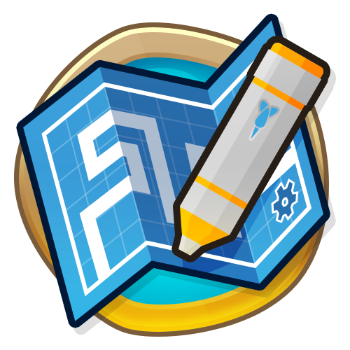

<h1 align="center">AncientMonkey</h1>

This is an empty mod generated by BTD6 Mod Helper

For your mod, remember to add the GitHub topic "btd6-mod"

Features a GitHub actions setup to automatically build the mod whenever commits are pushed,
and publish a release if a tag is pushed (using the LATEST.md as the body).

